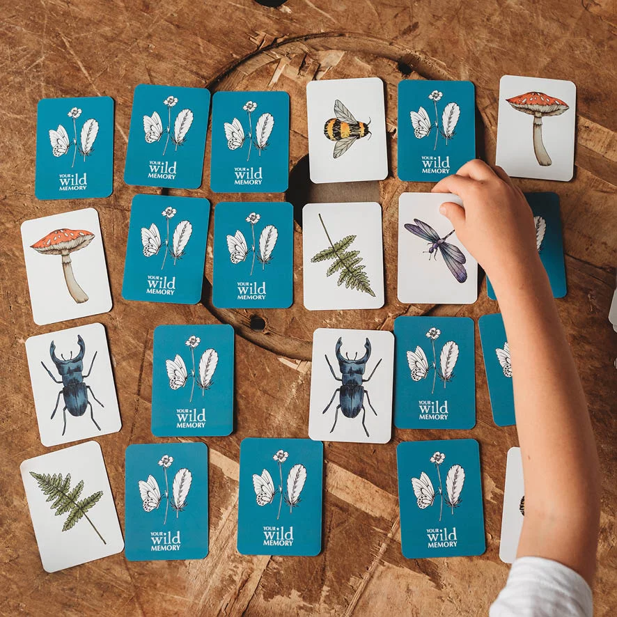
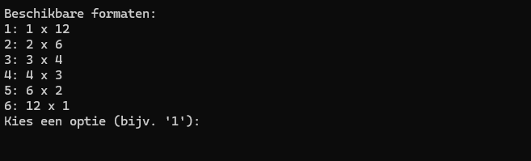
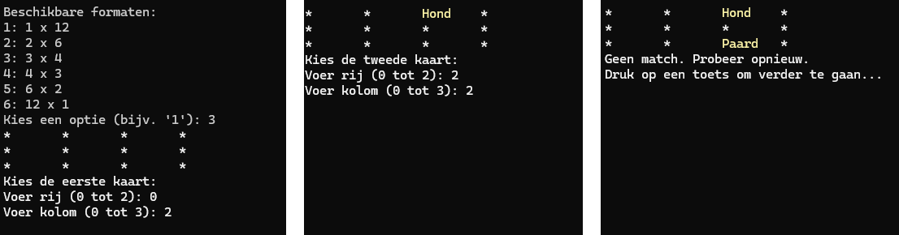
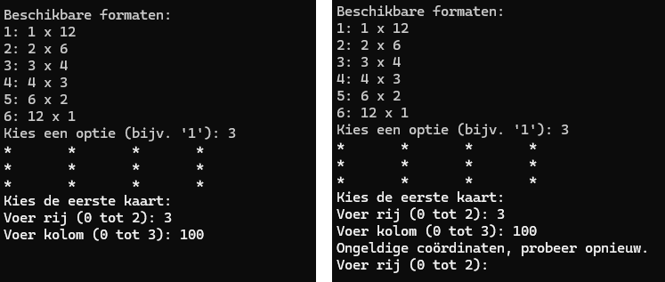
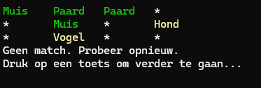

# 2DArrays-3---MemoryCards

In deze opdracht ga je een eenvoudig Memory-spel bouwen met behulp van C#. Het spel gebruikt een 2D-array om een grid met woorden te representeren. De speler onthult steeds twee woorden door coördinaten in te voeren. Als de woorden overeenkomen, worden ze permanent zichtbaar. Het spel eindigt wanneer alle paren zijn gevonden.

<p align="center">
    
</p>

## **Leerdoelen**
- Werken met arrays en 2D-arrays.
- Het implementeren van methodes om herbruikbare logica te bouwen.
- Input vragen van de gebruiker en validatie toepassen.
- Werken met loops en conditionele logica.
- Visuele output formatteren in de console, inclusief kleurgebruik.

Hieronder volgen de oefeningen/stappen die samen een volledig werkend Memory-spel vormen. Elke oefening bouwt voort op de vorige. De volledige Game logic is reeds gegeven die alle stappen combineert.

> [!CAUTION]
> *Let Op*: Oefeningen 2 en 3 zijn iets moeilijker. De oefeningen volgen de volgorde van de spel-logica. Indien je deze te moeilijk vindt, sla ze dan over en kom er later op terug.

<!--OEFENING 1------------------------------------------------------->

<details>
<summary> 

## Oefening 1: Maak de array met alle woorden van het grid
</summary>


Maak een methode, `CreateWordArray()`, die een 1D-array met unieke woorden retourneert. Deze woorden worden gebruikt in het spel. De woorden in de array moeten uniek zijn. 

Bovendien wil je liefst dat elk woord korter is dan één tab. Als je langere woorden wilt gebruiken, dan zal je meer uitdaging hebben om je Grid mooi uitgelijnd te krijgen.

**Voorbeeld:**
```
string[] words = CreateWordArray();
// inhoud van words: Kat, Hond, Muis, Vogel, Paard, Vis
```

</details>

<!--OEFENING 2------------------------------------------------------->


<details>
<summary>

## Oefening 2: Bereken alle mogelijke formaten van het grid
</summary>

In deze oefening maak je een methode, `GenerateAllPossibleFormats(string[] words)`, die berekent welke mogelijke gridformaten (rijen x kolommen) kunnen worden gebruikt om een Memory-spel te spelen. Het grid moet alle woorden bevatten die verdubbeld worden, en elke combinatie van rijen en kolommen moet passen bij het totaal aantal woorden.

**Doel:**
Je maakt een methode die alle mogelijke combinaties van rijen en kolommen retourneert waarmee een Memory-spelgrid kan worden gevuld. Het totaal aantal woorden (inclusief verdubbeling) moet gelijk zijn aan het aantal cellen in het grid.

**Stap 1: Begrijp de input en output van de methode**
- De methode krijgt een array van unieke woorden mee als parameter.
- De methode retourneert een 2D-array (string[,]) waarin elke rij een combinatie van rijen en kolommen bevat.
*Bijvoorbeeld*:
```
// input:
    "Kat", "Hond", "Muis", "Vogel", "Paard", "Vis"
// output: 
// een verzameling van mogelijke dimensies
// { { aantalRijen1, aantalKolommen1} , { aantalRijen2, aantalKolommen2 }, ... }
    2 x 6
    3 x 4
    4 x 3
    6 x 2
```
**Stap 2: Bereken het totale aantal woorden, *totalWords*, in het spel**
- Elk woord in de input-array komt twee keer voor in het Memory-spel.

**Stap 3: Vind alle mogelijke combinaties van rijen en kolommen**
- Het totaal aantal cellen in het grid moet gelijk zijn aan *totalWords*.
- Loop door mogelijke aantallen rijen van 1 tot *totalWords*.
- Voor elk aantal rijen, controleer of *totalWords* gelijk kan worden verdeeld in kolommen. 
  
> [!TIP]
> 
<details> <summary>Tip</summary> Dit betekent dat totalWords % rijen == 0. </details>

- Je moet deze rijen en kolom-combinaties nog niet opslaan. Tel eerst hoeveel combinaties er zijn, zodat je weet hoe groot de 2D array is die je maakt om alle combinaties in op te slaan.
  *Als je met een List kan werken, dan kan je deze meteen opslaan.*

**Stap 4: Sla de combinaties op in een 2D-array:**
- Maak een index of teller aan die onthoudt waar je het volgende coördinaat kan opslaan in de 2D-array.
- Doorloop opnieuw door alle rijen van 1 tot *totalWords*.
- Indien totalWords gelijk verdeeld kan worden in kolommen, dan voeg je deze combinatie van rijen en kolommen toe aan de 2D-array. *(en verhoog je index)*

    
<details>
	<summary>Te moeilijk? Hieronder volgt een mogelijke oplossing van Oefening 2</summary><p>


#### Oplossing: Oefening 2

```
// Oefening 2: Mogelijke gridformats genereren
// Stap 2: Mogelijke gridformaten genereren
static int[,] GenerateAllPossibleFormats(string[] singleWordArray)
{
    int totalWords = singleWordArray.Length * 2;
    int formatsCount = 0;

    for (int rows = 1; rows <= totalWords; rows++)
        if (totalWords % rows == 0) formatsCount++;

    int[,] formats = new int[formatsCount, 2];
    int index = 0;

    for (int rows = 1; rows <= totalWords; rows++)
    {
        if (totalWords % rows == 0)
        {
            int columns = totalWords / rows;
            formats[index, 0] = rows;
            formats[index, 1] = columns;
            index++;
        }
    }
    return formats;
}
```
</p>
</details>

</details>

## Oefening 3: Laat de speler een gridformaat kiezen

In deze oefening maak je een methode waarmee de speler een formaat voor het Memory-spel kan kiezen uit de mogelijke opties. Het doel is dat de speler interactief een formaat kiest via de console.

**Doel**
Je maakt een methode, `ChooseMemoryGridDimensions(int[,] formats)`, die de speler een lijst met mogelijke formaten toont (bijvoorbeeld 2x6, 3x4) en een keuze laat maken. Het gekozen formaat wordt geretourneerd.

**Stap 1: Begrijp de input en output van de methode**
- De methode krijgt een 2D-array (string[,]) mee waarin elk rij/kolom-paar een mogelijk gridformaat voorstelt.
- De methode retourneert een 1D-array (string[]) met twee elementen: het aantal rijen en het aantal kolommen dat de speler heeft gekozen.

**Stap 2: Toon een overzicht met mogelijke formaten**
- Gebruik een lus om door de rijen van de inputarray (string[,]) te itereren.
- Nummer de formaten in de lijst (bijvoorbeeld: "1: 2 x 6").
- Toon de formaten op de console, zodat de speler een keuze kan maken.

    *Mogelijke output naar gebruiker:*
   <p align="center">
    
   </p>

**Stap 3: Vraag de speler om een keuze**
- Controleer of de invoer geldig is (het getal moet tussen 1 en het aantal formaten liggen). Als de invoer ongeldig is, geef een foutmelding en vraag opnieuw om een invoer.

*Voorbeeld input + output van `ChooseMemoryGridDimensions(int[,] formats)`:*
```
// input methode:
    { 2, 6 }, 
    { 3, 4 }, 
    { 4, 3 }, 
    { 6, 2 } 
// Voorbeeld console-output:
Beschikbare gridformaten:
1: 2 x 6
2: 3 x 4
3: 4 x 3
4: 6 x 2

Kies een formaat door een nummer in te voeren: 
// Voorbeeld console-invoer:
2
// output methode:
    { 3, 4 }
```

## Oefening 4: Verdubbel de woorden in de array

In deze oefening maak je een methode, *DuplicateWordsInArray(string[] words)*, die de woorden in een array verdubbelt. Dit is nodig omdat elk woord in een Memory-spel twee keer voorkomt. De methode retourneert een nieuwe array waarin elk woord twee keer voorkomt.

**Doel**
Je maakt een methode die een nieuwe array creëert waarin elk woord uit de input-array twee keer voorkomt. Deze nieuwe array is twee keer zo groot als de originele array.

**Stap 1: Begrijp de input en output van de methode**
- De methode krijgt een string[] als input, met unieke woorden.
- De methode retourneert een nieuwe string[] waarin elk woord twee keer voorkomt.

**Stap 2: Bepaal de grootte van de nieuwe array**
- De lengte van de nieuwe array is gelijk aan twee keer de lengte van de input-array.

**Stap 3: Kopieer de woorden naar de nieuwe array**
- Gebruik een lus om elk woord uit de input-array toe te voegen aan de nieuwe array.
- Voeg elk woord twee keer toe op een vrije plaats.

## Oefening 5: Schud de array van woorden

In deze oefening maak je een methode, `ShuffleArray(string[] array)`, die de woorden in een array willekeurig door elkaar schudt. Dit is nodig om ervoor te zorgen dat de woorden in het Memory-spel niet op een voorspelbare volgorde staan.

Je moet hier eigenlijk zelfs geen waarde retourneren, aangezien je input parameter een reference type is.

**Stappen:**
- Doorloop elk element in de array.
- Kies een random index `r` voor het huidige element.
- Verwissel het huidige element met index `i` van plaats met de random index `r`.


## Oefening 6: Maak een 2D Memory-grid
De methode `FillGridWithArray(string[] words, int rows, int cols)` maakt een willekeurig gevuld 2D-grid aan voor het Memory-spel. Het grid gebruikt de geshufflede woorden uit oefening 5 en plaatst deze één voor één in een 2D-array met de gekozen dimensies.

**Stappen**
- Initialiseer een 2D-array voor de gekozen dimensies.
- Doorloop de rijen en kolommen om één voor één de woorden uit de doorgegeven. 

*Voorbeeld input + output*
```
// input:
{ "Kat", "Muis", "Kat", "Muis", "Hond", "Hond" }
// ouput:
{
    { "Kat", "Muis", "Kat" },
    { "Muis", "Hond", "Hond" }
};

```

## Oefening 7: Controleer of alle woorden gevonden zijn
Maak een methode die een 2D-bool array controleert. In de Main methode wordt er reeds een 2D-bool array aangemaakt waarin de gevonden woorden worden aangeduid.

Schrijf de methode `AreAllValuesTrue(bool[,] isFound)` die enkel true retourneert als alle waardes in de array true zijn. Anders geeft de methode false terug.

## Oefening 8: Toon het Memory Grid

De methode `ShowMemoryGrid(string[,] grid, bool[,] isFound)` toont het Memory-grid in de console. Het gebruikt de 2D-array van woorden en een bijbehorende boolean-array om te bepalen welke woorden zichtbaar zijn. Gevonden woorden worden weergegeven in groen, terwijl verborgen woorden met witte tekst als een * worden weergegeven.

- Gebruik lussen om het grid te visualiseren.
- Je kan met `Console.ForegroundColor = ConsoleColor.Green;` de kleur van de Console aanpassen.

## Oefening 9: Vraag de Speler om Coördinaten

De methode `PromptCoordinates(int rows, int cols)` vraagt de speler om de coördinaten van een woord op het Memory-grid in te voeren. Het valideert de invoer om ervoor te zorgen dat de ingevoerde coördinaten binnen de grenzen van het grid liggen.

Indien de gebruiker geen geldige input meegeeft, dan wordt de gebruiker verwittigd van de ongeldige input en moet hij/zij opnieuw coördinaten ingeven.

De methode retourneert een array met de ingegeven { rijIndex, kolomIndex }.

*Mogelijke output naar gebruiker:*
   <p align="center">
    
   </p>
   <p align="center">
    
   </p>
Gebruik vervolgens Oefening 10 om de gekozen { rijIndex, kolomIndex } te tonen.


# Oefening 10: Controleer en Verwerk een Match
De methode `ShowTempWordsAndMemoryGrid(string[,] grid, bool[,] gevonden, int[] coord1)` en `ShowTempWordsAndMemoryGrid(string[,] grid, bool[,] gevonden, int[] coord1, int[] coord2)` tonen tijdelijk de woorden die de speler heeft gekozen op basis van de doorgegeven coördinaten in het gehele Memory-grid. 

De gekozen woorden worden in het geel weergegeven om de speler te laten zien welke woorden tijdelijk zijn onthuld.

Overload de methodes door een versie te maken die één tijdelijk, geel woord onthuld. Verder voorzie je een tweede methode die twee coördinaten ontvangt om twee tijdelijke, gele woorden te tonen.

*Mogelijke output naar gebruiker:*
   <p align="center">
    
   </p>

